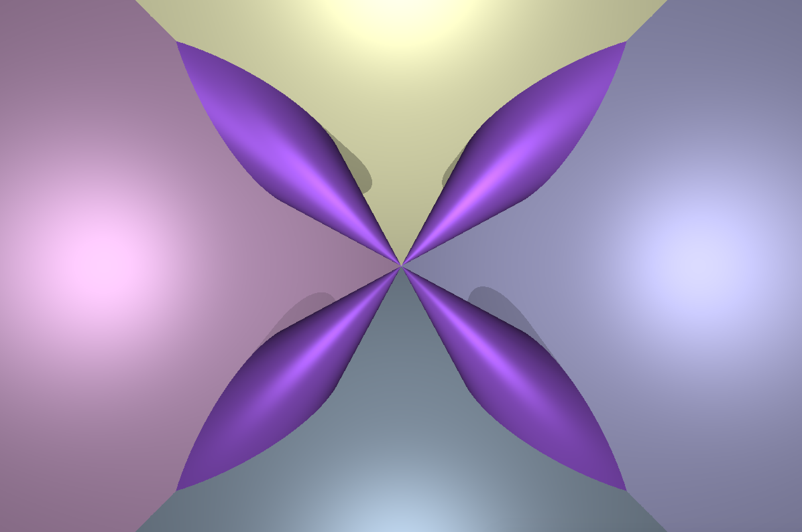
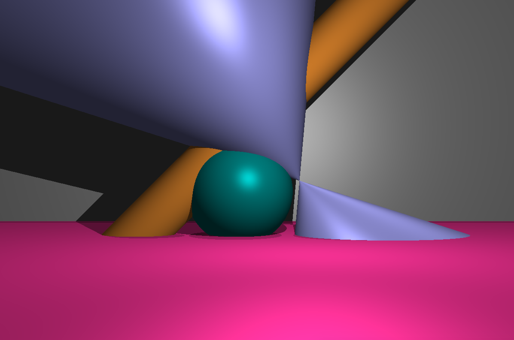
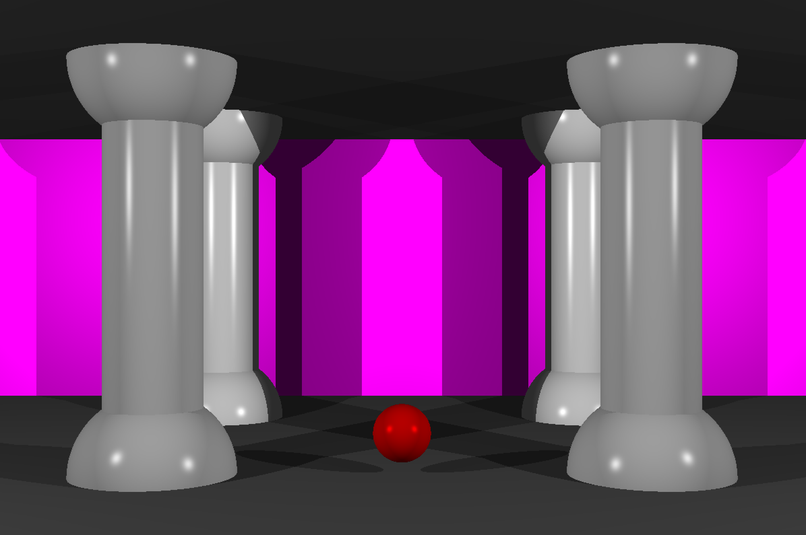

# RTv1
Introduction to a Ray Tracing technique. Simplified version of the RT project. Solo project

## About
A program generates images of scenes using raytracing method. 

A scene can contain simple **geometric objects** (e.g. spheres, cylinders, cones, planes) and **light sources** (ambient, point, directional).

Each geometric object has its:
- color;
- position;
- direction (except sphere);
- shine effect (optional);

Each light source has its:
- intensity coefficient;
- position (for point light);
- direction (for directional light);

Camera can move along global axis (x, y, z) and rotate.

Graphic library: ***miniLibX***

## How to run
Download repository, open it in terminal and run `make`. This will create an executable with object files.

You have four preset scenes, which you can open by passing a corresponding parameter (from `scene1` to `scene4`) to the program:

```
./RTv1 scene3
```


```
./RTv1 scene4
```

